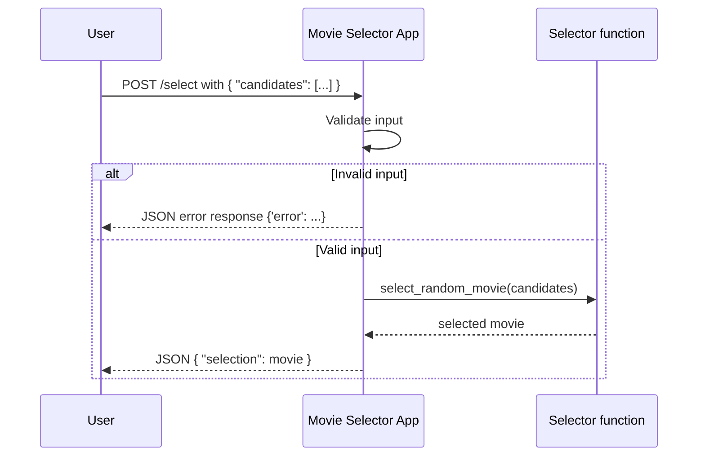

# Random Movie Selector API
A Flask-based API that randomly selects a movie title from a list of provided candidates.
## Features

-   Accepts a list of movie titles via a JSON `POST` request.
    
-   Returns one randomly selected movie from the list.
    
-   Basic input validation to ensure all candidates are strings.

## Getting Started
### Installation

1.  Clone this repository or copy the script.

2. Create an environment:
`python3 -m venv .venv`

3. Activate environment:
`. .venv/bin/activate`

4.  Install dependencies:
`pip install flask` 

5.  Run the flask application:
`flask --app movie_selector run` 

By default, the server runs at `http://127.0.0.1:5000`.

## How to Request Data
Data is requested by sending a `POST` request to the `/select` endpoint with a JSON body containing an array of movie titles under the `candidates` key. The below example shows how to do this using Python and the `requests` library.

### Example Request
```
import requests

# Define the URL
url = "http://127.0.0.1:5000/select"

# Define the JSON array
candidates = {
    "candidates": ["Inception", "The Devil Wears Prada", "Anora"]
}

# Make the POST request
response = requests.post(url, json=candidates)
```

## How to Receive Data 
Data is received from the HTTP response by sending a POST request with JSON data to the Flask server at `/select`.

The JSON response may be formatted in the following ways:
#### Successful Response Example

`{  "selection":  "Inception"  }` 

#### Error Response (invalid input)

`{  "error":  "Candidates must be a non-empty array of strings."  }`

### Example of Receiving Data:
```
# Make POST request, receive response as JSON object
movie = requests.post(url, json=candidates)  
```

## UML diagram

